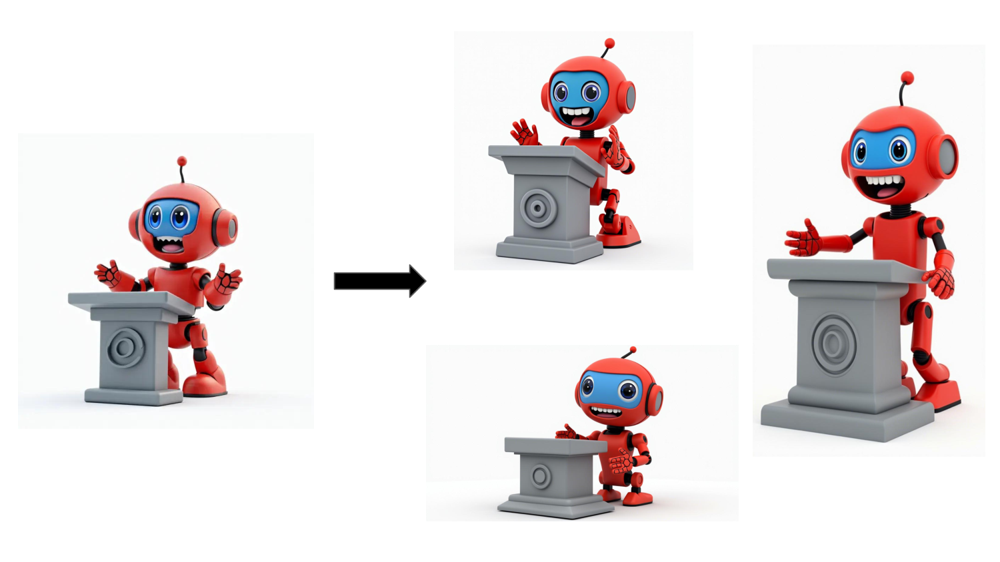

## Models

FLUX.1 Redux is an adapter for the FLUX.1 text-to-image base models, FLUX.1 [dev] and FLUX.1 [schnell], which can be used to generate image variations. 
In addition, FLUX.1 Redux [pro] is available in our API and, augmenting the [dev] adapter, the API endpoint allows users to modify an image given a textual description. The feature is supported in our latest model FLUX1.1 [pro] Ultra, allowing for combining input images and text prompts to create high-quality 4-megapixel outputs with flexible aspect ratios.

| Name                        | HuggingFace repo                                                                                | License                                                               | sha256sum                                                        |
| --------------------------- | ----------------------------------------------------------------------------------------------- | --------------------------------------------------------------------- | ---------------------------------------------------------------- |
| `FLUX.1 Redux [dev]`        | https://huggingface.co/black-forest-labs/FLUX.1-Redux-dev                                       | [FLUX.1-dev Non-Commercial License](model_licenses/LICENSE-FLUX1-dev) | a1b3bdcb4bdc58ce04874b9ca776d61fc3e914bb6beab41efb63e4e2694dca45 |
| `FLUX.1 Redux [pro]`        | [Available in our API.](https://docs.bfl.ml/) Supports image variations.                        |
| `FLUX1.1 Redux [pro] Ultra` | [Available in our API.](https://docs.bfl.ml/) Supports image variations based on a text prompt. |

## Examples



## Open-weights usage

The text-to-image base model weights and the autoencoder weights will be downloaded automatically from HuggingFace once you start the demo. To download `FLUX.1 [dev]`, you will need to be logged in, see [here](https://huggingface.co/docs/huggingface_hub/guides/cli#huggingface-cli-login). You need to manually download the adapter weights from [here](https://huggingface.co/black-forest-labs/FLUX.1-Redux-dev) and specify them via an environment variable `export FLUX_REDUX=<path_to_flux_redux_sft_file>`. In general, you may specify any manually downloaded weights via environment variables:

```bash
export FLUX_REDUX=<path_to_flux_redux_sft_file>
export FLUX_SCHNELL=<path_to_flux_schnell_sft_file>
export FLUX_DEV=<path_to_flux_dev_sft_file>
export AE=<path_to_ae_sft_file>
```

For interactive sampling run

```bash
python -m src.flux.cli_redux --loop --name <name>
```

where `name` is one of `flux-dev` or `flux-schnell`.
