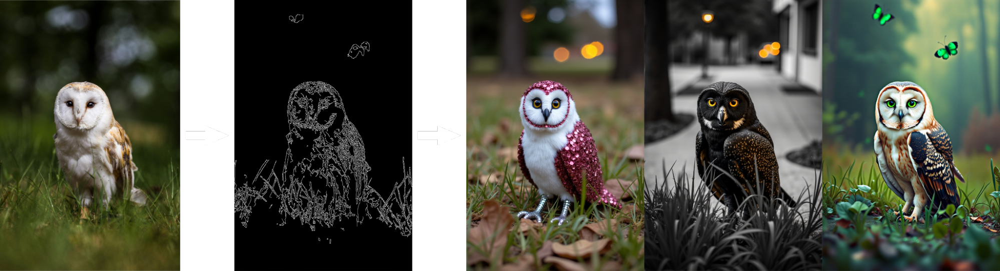
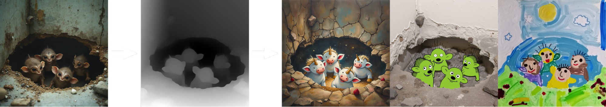

## Models

Structural conditioning uses canny edge or depth detection to maintain precise control during image transformations. By preserving the original image's structure through edge or depth maps, users can make text-guided edits while keeping the core composition intact. This is particularly effective for retexturing images. We release four variations: two based on edge maps (full model and LoRA for FLUX.1 [dev]) and two based on depth maps (full model and LoRA for FLUX.1 [dev]).

| Name                      | HuggingFace repo                                               | License                                                               | sha256sum                                                        |
| ------------------------- | -------------------------------------------------------------- | --------------------------------------------------------------------- | ---------------------------------------------------------------- |
| `FLUX.1 Canny [dev]`      | https://huggingface.co/black-forest-labs/FLUX.1-Canny-dev      | [FLUX.1-dev Non-Commercial License](model_licenses/LICENSE-FLUX1-dev) | 996876670169591cb412b937fbd46ea14cbed6933aef17c48a2dcd9685c98cdb |
| `FLUX.1 Depth [dev]`      | https://huggingface.co/black-forest-labs/FLUX.1-Depth-dev      | [FLUX.1-dev Non-Commercial License](model_licenses/LICENSE-FLUX1-dev) | 41360d1662f44ca45bc1b665fe6387e91802f53911001630d970a4f8be8dac21 |
| `FLUX.1 Canny [dev] LoRA` | https://huggingface.co/black-forest-labs/FLUX.1-Canny-dev-lora | [FLUX.1-dev Non-Commercial License](model_licenses/LICENSE-FLUX1-dev) | 8eaa21b9c43d5e7242844deb64b8cf22ae9010f813f955ca8c05f240b8a98f7e |
| `FLUX.1 Depth [dev] LoRA` | https://huggingface.co/black-forest-labs/FLUX.1-Depth-dev-lora | [FLUX.1-dev Non-Commercial License](model_licenses/LICENSE-FLUX1-dev) | 1938b38ea0fdd98080fa3e48beb2bedfbc7ad102d8b65e6614de704a46d8b907 | 
| `FLUX.1 Canny [pro]`      | [Available in our API](https://docs.bfl.ml/).                  |
| `FLUX.1 Depth [pro]`      | [Available in our API](https://docs.bfl.ml/).                  |

## Examples




## Open-weights usage

The full model weights (`FLUX.1 Canny [dev], Flux.1 Depth [dev], FLUX.1 [dev], and the autoencoder) will be downloaded automatically from HuggingFace once you start one of the demos. To download them, you will need to be logged in, see [here](https://huggingface.co/docs/huggingface_hub/guides/cli#huggingface-cli-login). The LoRA weights are not downloaded automatically, but can be downloaded manually [here (Canny)](https://huggingface.co/black-forest-labs/FLUX.1-Canny-dev-lora) and [here (Depth)](https://huggingface.co/black-forest-labs/FLUX.1-Depth-dev-lora). You may specify any manually downloaded weights via environment variables: (**necessary for LoRAs**):

```bash
export FLUX_DEV_DEPTH=<path_to_flux_dev_depth_sft_file>
export FLUX_DEV_CANNY=<path_to_flux_dev_canny_sft_file>
export FLUX_DEV_DEPTH_LORA=<path_to_flux_dev_depth_lora_sft_file>
export FLUX_DEV_CANNY_LORA=<path_to_flux_dev_canny_lora_sft_file>
export FLUX_REDUX=<path_to_flux_redux_sft_file>
export FLUX_SCHNELL=<path_to_flux_schnell_sft_file>
export FLUX_DEV=<path_to_flux_dev_sft_file>
export AE=<path_to_ae_sft_file>
```

For interactive sampling run

```bash
python -m src.flux.cli_control --loop --name <name>
```

where `name` is one of `flux-dev-canny`, `flux-dev-depth`, `flux-dev-canny-lora`, or `flux-dev-depth-lora`.

## Diffusers usage

Flux Control (including the LoRAs) is also compatible with the `diffusers` Python library. Check out the [documentation](https://huggingface.co/docs/diffusers/main/en/api/pipelines/flux) to learn more.
